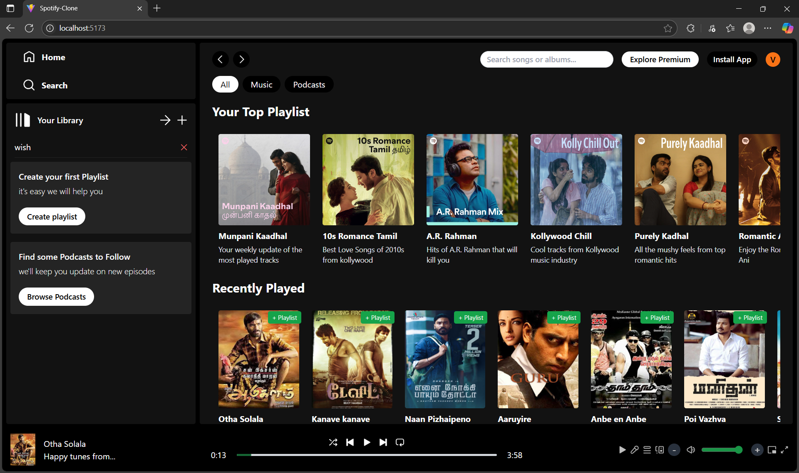

# Spotify Clone 🎵



A modern, responsive Spotify-inspired music player built with React and Tailwind CSS. This project replicates the look and feel of Spotify, allowing users to browse albums, play songs, search music, and manage custom playlists—all in a beautiful web interface.

## Features

- 🎨 **Modern UI**: Clean, Spotify-like design with responsive layouts for desktop and mobile.
- 🔍 **Search**: Instantly search for songs and albums.
- ▶️ **Music Player**: Play, pause, skip, seek, and control volume for songs.
- 📚 **Albums & Songs**: Browse curated albums and song lists.
- ➕ **Custom Playlists**: Create your own playlists and add/remove songs.
- 💾 **Persistent Playlists**: Playlists are saved in your browser (localStorage).

## Getting Started

### Prerequisites
- Node.js (v16 or higher recommended)
- npm

### Installation
1. **Clone the repository:**
   ```bash
   git clone <your-repo-url>
   cd SpotifyClone-main
   ```
2. **Install dependencies:**
   ```bash
   npm install
   ```
3. **Start the development server:**
   ```bash
   npm run dev
   ```
4. **Open in your browser:**
   Visit [http://localhost:5173](http://localhost:5173)

## Usage
- **Browse**: Explore albums and recently played songs from the home page.
- **Search**: Use the search bar to find songs or albums.
- **Playlists**: Create playlists from the sidebar, add songs using the '+' button, and manage your collection.
- **Player**: Use the bottom player to control playback and volume.

## Technologies Used
- React
- Tailwind CSS
- Vite
- React Router

---

Enjoy your music experience!

